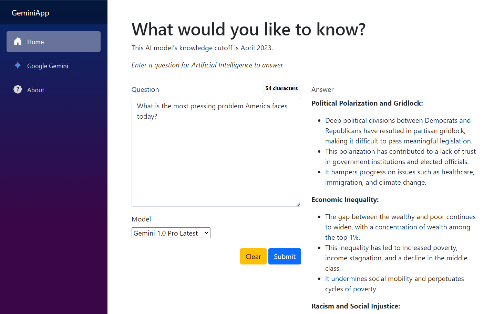

# Gemini Application

This repository contains source code for several website applications implemented in different languages and frameworks.

 - ASP.NET Core 8.0 Blazor
 - Node.js 20.12 + Express.js
 - PHP 8.3 + Apache
 - Python 3.12 + Django
 - Python 3.12 + Flask

Each application implements the [Gemini REST API](https://ai.google.dev/tutorials/rest_quickstart) and is deployed on Google Cloud Run.

Each application supports sending questions to Google Gemini and displaying the response. The purpose is to demonstrate how to interface with Google Gemini.

Three Google Gemini models are supported:

 - Google Gemini 1.0 Pro
 - Google Gemini 1.0 Ultra
 - Google Gemini 1.5 Pro

## Example Application Screenshot

ASP.NET Blazor deployed on Google Cloud Run.

