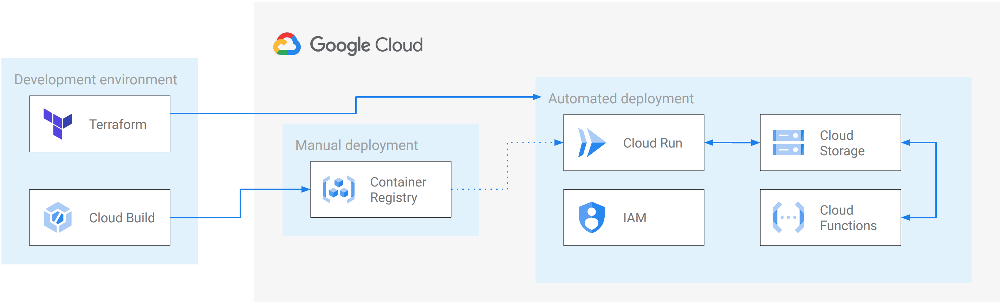
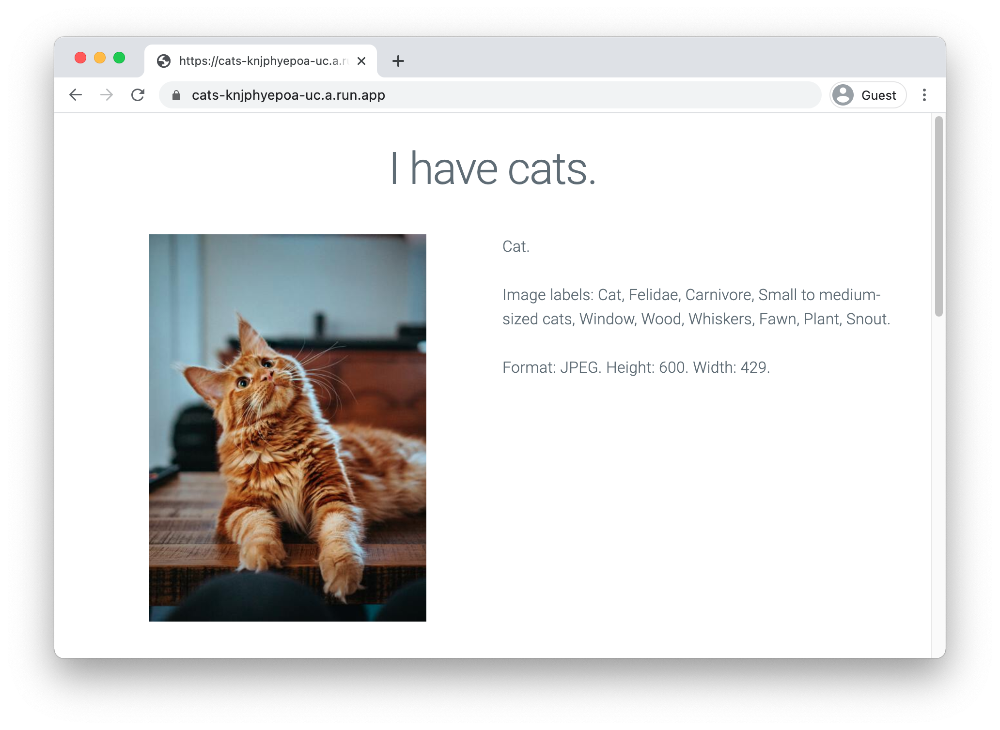

# Infrastructure

## Architecture



Cloud Build is used to create a container in Container Registry. 

Terraform is used to create the Cloud Run service (sourcing from Container Registry), Cloud Storage, and Cloud Functions. IAM is configured throughout the automation. 

## Sample deployment



A Cloud Function uses Vision API to detect labels and image attributes in the sent bucket/object name. The Cloud Run service iterates through all the images in a Storage bucket, sending requests to the aforementioned Function. 

## Production setup

For production use cases, it's best to setup a terraform state storage bucket and service account


* Establish terraform state storage in your project
    ```
    PROJECT_ID=$(gcloud config get-value project)
    BUCKET=${PROJECT_ID}-tfstate
    gsutil mb gs://${BUCKET}
    gsutil versioning set on gs://${BUCKET}
    ```

* In `main.tf`, add the following lines: 
    ```diff
     terraform { 
    +   backend "gcs" {
    +     bucket = "<BUCKET>"
    +   }
    ```

  Replace `<BUCKET>` with the bucket you just created (Terraform will not accept a variable for this field.)

* [Create a service account](https://registry.terraform.io/providers/hashicorp/google/latest/docs/guides/getting_started#adding-credentials) and enable the associated service: 

    ```
    gcloud service enable cloudresoursemanager.googleapis.com
    ```


## Terraform  

Terraform can be [download](https://www.terraform.io/downloads.html) for many platforms. 

Standard manifest files: 

* `main.tf` - the main Terraform file
* `variables.tf` - declares variables
* `outputs.tf` - declares outputs

Custom files: 
* `project.tf` - the project level elements, including the IAM service account
* `function.tf` - the processing function, including the Cloud Function
* `service.tf` - the web service, including the Cloud Run service
* `media.tf` - the media assets, including the Cloud Storage bucket


# General Terraform tips

## On error, reapply

Sometimes issues can occur where services are eventually consistant. If you encounter an error relating to services not being enabled, or resources not existing, try running terraform again before continuing.

## Check the version

This tutorial opts to use Cloud Builders for terraform, to prevent having to install terraform locally, or using an outdated version (this configuration uses syntax not available in the version available by default on Cloud Shell).

## State restoration

If state is lost, it can be recreated by importing the stateful elements, and deleting the stateless ones. For example:

```
terraform import -var project=${PROJECT_ID} google_storage_bucket.media ${PROJECT_ID}-media
terraform import -var project=${PROJECT_ID} google_storage_bucket.source ${PROJECT_ID}-source
gcloud functions delete processing-function
gcloud run services delete cats
```

Then run `terraform init && terraform apply` again. 

## Manifest development

If when developing the terraform manifest and state is complex, configure manually, then export settings using [terraformer](https://github.com/GoogleCloudPlatform/terraformer).

## Force re-deploy of service

```
gcloud builds submit
gcloud run deploy --image gcr.io/${PROJECT_ID}/cats
```

## Local debugging

Install functions framework, and run function locally:

```
cd function

virtualenv venv
source venv/bin/activate
pip install -r requirements.txt functions-framework

functions-framework --target detect_cat --debug
```

In another terminal, run service locally, refercing local function: 

```
cd service

virtualenv venv
source venv/bin/activate
pip install -r requirements.txt

BUCKET_NAME=${PROJECT_ID}-media FUNCTION_NAME=http://0.0.0.0:8080 PORT=8081 python app.py
```

Open website at [http://0.0.0.0:8081/](http://0.0.0.0:8081/)
